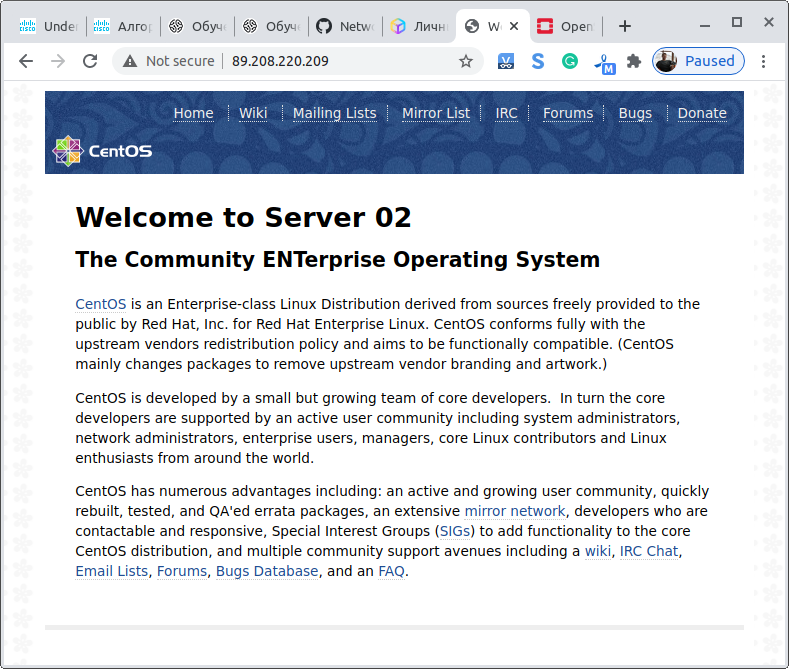

## Обязательное задание:
### 1. Создание 2 ВМ в двух разных зонах используя CLI.
### 2. Создание LB из CLI (может потребовать отдельной утилиты).
### 3. Эмуляция падения одного домена (выключение 1 из ВМ) сервис при этом остается доступен.

## Дополнительное задание:
### Создание той же инфраструктуры что из первого задания используя IaC (например Terraform).
Пример: https://github.com/MailRuCloudSolutions/terraform-demo

После проверки заданий не забудьте запустить кластер k8s для обучения на второй части третьей четверти.

## Решение

### 1. Создание 2 ВМ в двух разных зонах используя CLI.

#### 1.1 Сервер cent-nginx01
<pre>
server create cent-nginx01 --flavor 25ae869c-be29-4840-8e12-99e046d2dbd4 --image 4525415d-df00-4f32-a434-b8469953fe3e --key-name alex-home --availability-zone MS1 --network gb_network_100

port set 5bbdfe77-6253-45b8-a2b0-e8390fcf2e93 --security-group ssh+www
floating ip set 069ec915-724c-4a30-94d4-0f7b79f14d19 --port 5bbdfe77-6253-45b8-a2b0-e8390fcf2e93

</pre>

#### 1.2 Сервер cent-nginx02 
<pre>
server create cent-nginx02 --flavor 25ae869c-be29-4840-8e12-99e046d2dbd4 --image 4525415d-df00-4f32-a434-b8469953fe3e --key-name alex-home --availability-zone DP1 --network gb_network_100

port set b8ccc502-844f-4e24-9d8c-a57a2cdb3f64 --security-group ssh+www
floating ip set e175fd9e-86d3-47c4-ba03-327d80748e2b --port b8ccc502-844f-4e24-9d8c-a57a2cdb3f64
</pre>

### 2. Создание LB из CLI (может потребовать отдельной утилиты).

#### 2.1 Создание балансера
<pre>
loadbalancer create --name lb-nginx01 --vip-subnet-id subnet_10_100_0

loadbalancer listener create --name lst-HTTP01 --protocol HTTP --protocol-port 80 lb-nginx01

loadbalancer pool create --name pool-HTTP01 --lb-algorithm ROUND_ROBIN --listener lst-HTTP01 --protocol HTTP

loadbalancer healthmonitor create --name hlth-HTTP01 --delay 5 --max-retries 4 --timeout 10 --type HTTP --url-path /index.html pool-HTTP01

loadbalancer member create --name mbr-nginx01 --address 10.100.0.14 --protocol-port 80 pool-HTTP01
loadbalancer member create --name mbr-nginx02 --address 10.100.0.15 --protocol-port 80 pool-HTTP01

floating ip set 16b02591-ff0e-4a33-a14c-f0ff81bf6540 --port 4761369a-5ed4-4eb1-b538-a29e1bd04b4f
</pre>

### 2.2 Результат

#### 2.2.2 Информация о серверах

<pre>
server list
+--------------------------------------+--------------+--------+--------------------------------------------+-------+--------------+
| ID                                   | Name         | Status | Networks                                   | Image | Flavor       |
+--------------------------------------+--------------+--------+--------------------------------------------+-------+--------------+
| 5546136d-2aa3-433b-9eff-d02d8bc82ccf | cent-nginx02 | ACTIVE | gb_network_100=10.100.0.14, 185.86.145.123 |       | Basic-1-1-10 |
| 1c0bf1f8-0cb9-4e7b-9c9e-1c2cf0b0e64a | cent-nginx01 | ACTIVE | gb_network_100=10.100.0.15, 85.192.34.187  |       | Basic-1-1-10 |
+--------------------------------------+--------------+--------+--------------------------------------------+-------+--------------+
</pre>

#### 2.2.2 Информация о балансере
<pre>
loadbalancer show lb-nginx01
+---------------------+--------------------------------------+
| Field               | Value                                |
+---------------------+--------------------------------------+
| admin_state_up      | True                                 |
| availability_zone   |                                      |
| created_at          | 2020-12-27T09:26:51                  |
| description         |                                      |
| flavor_id           |                                      |
| id                  | 0ae9b8e5-3323-4e93-ac49-ff151bfe1c33 |
| listeners           | 16191e30-74b0-4630-8516-a3dd431bd263 |
| name                | lb-nginx01                           |
| operating_status    | ONLINE                               |
| pools               | 1536cd41-f5ed-4b83-a2ac-c54ffb15bb28 |
| project_id          | 584a3a449c2a496aa250622204365d3e     |
| provider            | amphora                              |
| provisioning_status | ACTIVE                               |
| updated_at          | 2020-12-27T09:54:33                  |
| vip_address         | 10.100.0.24                          |
| vip_network_id      | ac1a8675-f82f-4c3c-bf27-a9b154e8795d |
| vip_port_id         | 4761369a-5ed4-4eb1-b538-a29e1bd04b4f |
| vip_qos_policy_id   | None                                 |
| vip_subnet_id       | 681c160b-1b7c-4c78-83e7-50c0599e7e32 |
+---------------------+--------------------------------------+
</pre>

#### 2.2.3 Информация об участниках пула

<pre>
loadbalancer member list pool-HTTP01
+--------------------------------------+-------------+----------------------------------+---------------------+-------------+---------------+------------------+--------+
| id                                   | name        | project_id                       | provisioning_status | address     | protocol_port | operating_status | weight |
+--------------------------------------+-------------+----------------------------------+---------------------+-------------+---------------+------------------+--------+
| fb057b88-4558-45f5-8014-c770ad9d071c | mbr-nginx01 | 584a3a449c2a496aa250622204365d3e | ACTIVE              | 10.100.0.14 |            80 | ONLINE           |      1 |
| f607af62-f190-4611-9fcf-4e4d2f4b98c7 | mbr-nginx01 | 584a3a449c2a496aa250622204365d3e | ACTIVE              | 10.100.0.15 |            80 | ONLINE           |      1 |
+--------------------------------------+-------------+----------------------------------+---------------------+-------------+---------------+------------------+--------+

</pre>

#### 2.2.4 Информация об участниках пула при выключенном первом сервере

<pre>
loadbalancer member list pool-HTTP01
+--------------------------------------+-------------+----------------------------------+---------------------+-------------+---------------+------------------+--------+
| id                                   | name        | project_id                       | provisioning_status | address     | protocol_port | operating_status | weight |
+--------------------------------------+-------------+----------------------------------+---------------------+-------------+---------------+------------------+--------+
| fb057b88-4558-45f5-8014-c770ad9d071c | mbr-nginx01 | 584a3a449c2a496aa250622204365d3e | ACTIVE              | 10.100.0.14 |            80 | ONLINE           |      1 |
| f607af62-f190-4611-9fcf-4e4d2f4b98c7 | mbr-nginx01 | 584a3a449c2a496aa250622204365d3e | ACTIVE              | 10.100.0.15 |            80 | ERROR            |      1 |
+--------------------------------------+-------------+----------------------------------+---------------------+-------------+---------------+------------------+--------+
</pre>

#### 2.2.5 Информация о внешних адресах

<pre>
floating ip list
+--------------------------------------+---------------------+------------------+--------------------------------------+--------------------------------------+----------------------------------+
| ID                                   | Floating IP Address | Fixed IP Address | Port                                 | Floating Network                     | Project                          |
+--------------------------------------+---------------------+------------------+--------------------------------------+--------------------------------------+----------------------------------+
| 069ec915-724c-4a30-94d4-0f7b79f14d19 | 85.192.34.187       | 10.100.0.15      | 5bbdfe77-6253-45b8-a2b0-e8390fcf2e93 | 298117ae-3fa4-4109-9e08-8be5602be5a2 | 584a3a449c2a496aa250622204365d3e |
| 16b02591-ff0e-4a33-a14c-f0ff81bf6540 | 89.208.220.209      | 10.100.0.24      | 4761369a-5ed4-4eb1-b538-a29e1bd04b4f | 298117ae-3fa4-4109-9e08-8be5602be5a2 | 584a3a449c2a496aa250622204365d3e |
| e175fd9e-86d3-47c4-ba03-327d80748e2b | 185.86.145.123      | 10.100.0.14      | b8ccc502-844f-4e24-9d8c-a57a2cdb3f64 | 298117ae-3fa4-4109-9e08-8be5602be5a2 | 584a3a449c2a496aa250622204365d3e |
+--------------------------------------+---------------------+------------------+--------------------------------------+--------------------------------------+----------------------------------+
</pre>

#### 2.2.6 Скриншоты браузера

